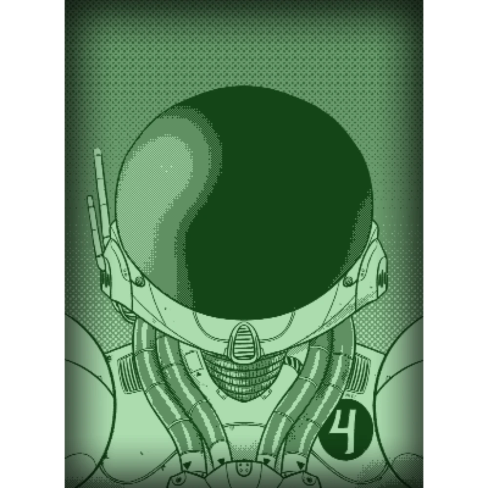

# Dawn Wave Jumper, Pirate  
  
  
  
A pirate on Collace's waves, now in the stars, Dawn Wave Jumper is an informant for [Talia](../Crew/TaliaFinlay.md) and a close friend. It serves mostly a mechanic role, often performing EVA due to her unique anatomy.  
  
A pink river dolphin in appearance, but clearly adapted for both sea and saltwater after the uplifting procedures. She glimmers majestically despite her scarring.    
  
Dawn Wave Jumper is a great source of information on Collace specifically and on the activities of pirates and corsairs in the system.  
  
[> Return to Contacts Index](./index.md)  
  
#friendly #contact