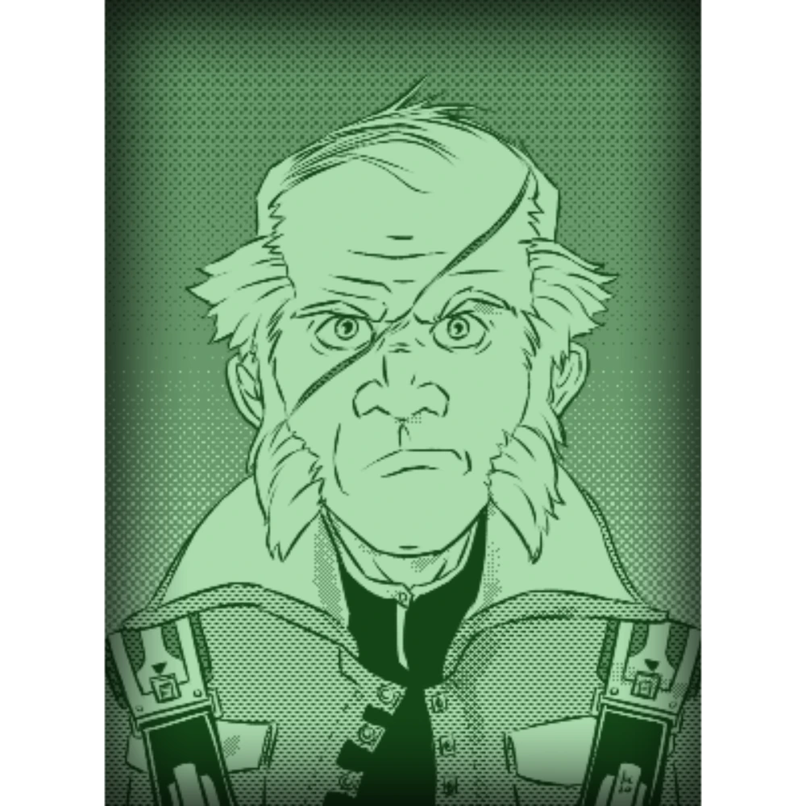

# Doctor Nikkolas Cell, Xenoarch  
  
  
Mad science and contemporary of [Rrhyngir](../Crew/Rrhyngir.md)'s time in the hackerspace, Doctor Nikkolas Cell has been called by some a "mad xenoarchaeologist" as he has been known to experiment on (highly illegal) technology belonging to the Ancients.  
  
He seems like he isn't all that there, though his mutton chops are precisely trimmed, which suggests otherwise.    
  
He would be useful for leads on the Ancients, or for information on the scientific community. He also has ties to the [Vargr](Vargr.md) of the sector, as he works with them to acquire his illegal artifacts.  
  
[> Return to Contacts Index](./index.md)  
  
#friendly #contact