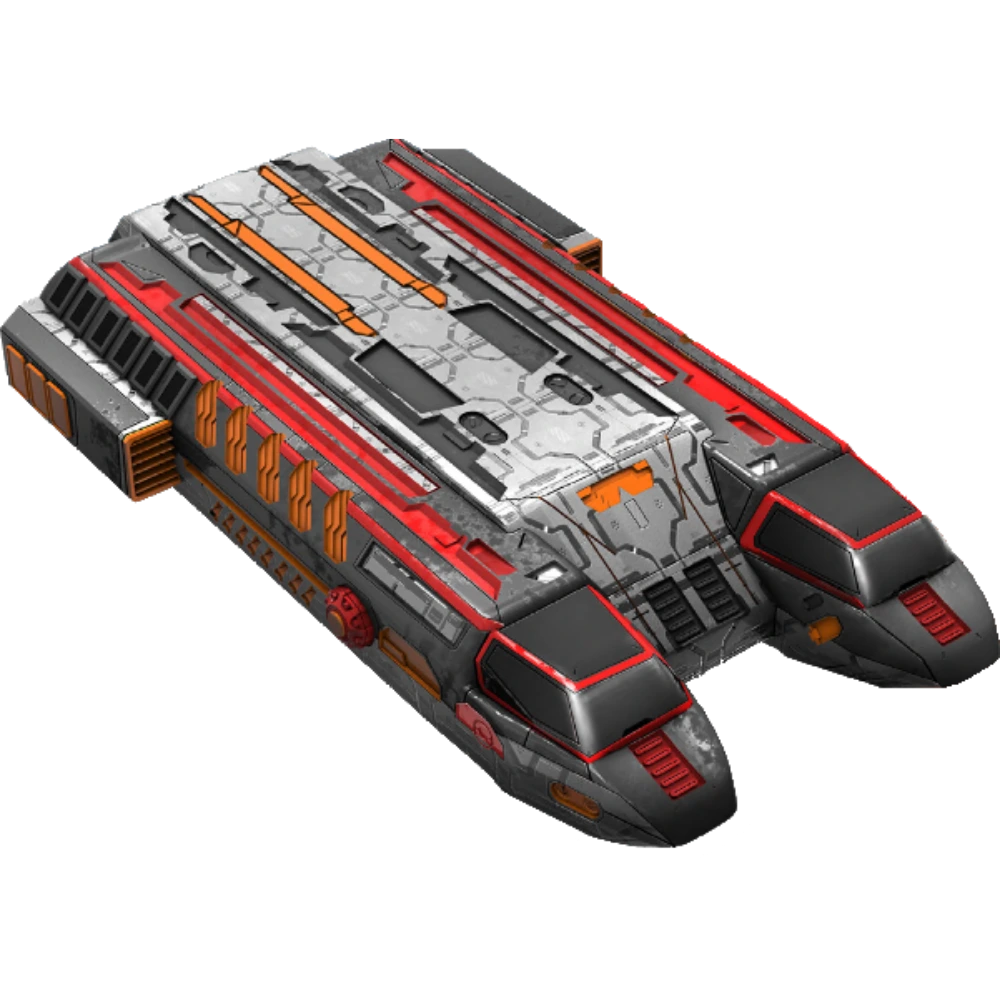

# IFT Be Back By Dawn Computer Systems  
  
  
  
## /status  
* HULL INTEGRITY: 80/80  
* FUEL: 21/41 TONS  
* ESCROW: 0.13644 MCr  
* TRANSPONDER MODE: Passive  
  
## /userdata  
  
* [Ship's Logs](./ShipPapers/ShipsLogs.md)  
* [Contacts](./Contacts/index.md)  
* [Missions](./Missions.md)  
* [Crew Profile Pages](./Crew/index.md)  
  
## /network  
  
* [Traveller News Society Bulletin Board](./TNS/index.md)  
* [Mercenary Ticket System](./MercenaryTicketSystem.md)  
* [IISS Survey Mission Board](./IISSBoard.md)  
  
## /programs  
* [Library Data](./LibraryData/index.md)  
* Jump Control: V1  
* Intellect: V1  
* Sensors: Civilian-Grade, Active  
  
## /admin  
* [Jump Log and Important Locations](./JumpLog.md)  
* [Ship Papers](./ShipPapers/index.md)  
  
